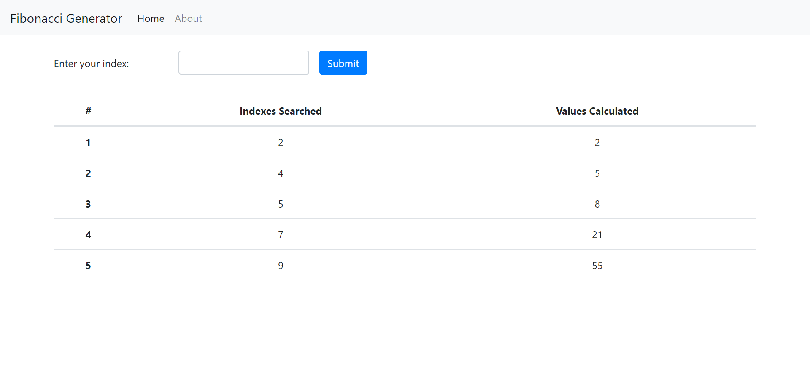

## Fibonacci Generator

### Docker Container Services

1. **Postgres** - To store the user searched indexes.
2. **Redis** - To store calculated fibonacci values for indexes.
3. **Nginx** - Routes request between react server and express api server in development. This way we don't have to specify and worry about application host or port for backend api.
4. **Api** - Express server handles the api request to fetch indexes from Postgres and values from Redis. It also stores all the user searched indexes in Postgres table and sends an event to worker process to calculate fibonacci value for the index.
5. **Client** - React based web application to render user interface, takes user input indexes and fetches the output result.
6. **Worker** - It listens for any insert event (index) on redis, calculates the fibonacci value and then updates the redis cache.

### Steps to run the application
$ docker-compose up --build